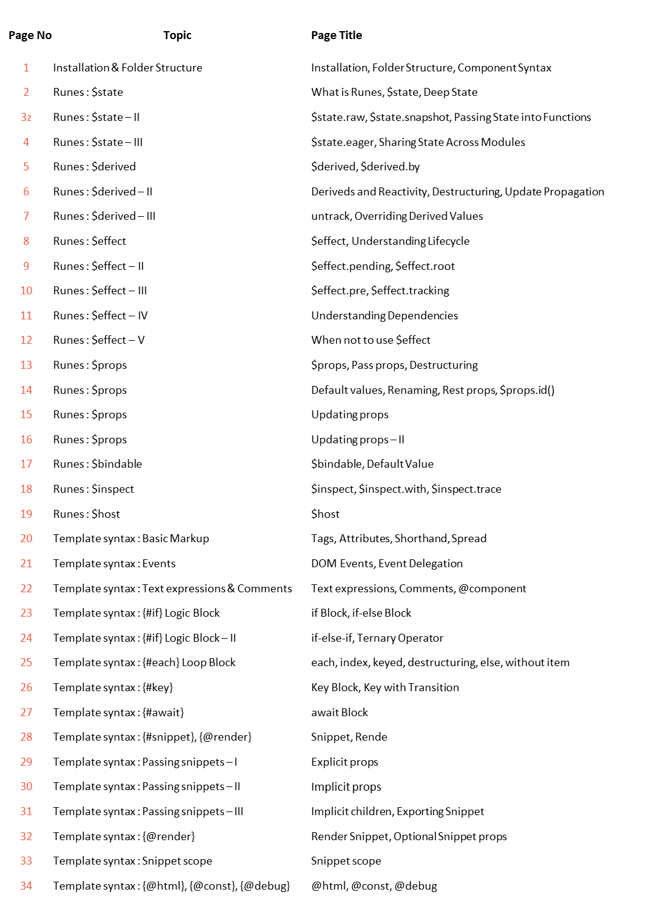

# Svelte v5 : Installation & Folder Structure

|     |                         |                                                |
| :-: | :---------------------- | :--------------------------------------------- |
|  ❶  | `npx sv create 1svelte` | # Initialize a new Git repository              |
|  ❷  | `dir –a`                | # Verify it worked — .git folder should appear |

Page No Topic Page Title
35 Template syntax : {@attach} Attachments, Auto focus, Tooltip, Inline Attachment
36 Template syntax : {@attach} – II Conditional attachment, Passing attachments to components
37 Template syntax : bind: Function binding, Input Value, Shorthand, Checkbox
38 Template syntax : bind: - II defaultChecked, indeterminate, Select
39 Template syntax : bind: - III bind:files, bind:group
40 Template syntax : bind: - IV Audio, Image
41 Template syntax : bind: - V Video, bind:property for components
42 Template syntax : bind: - VI details bind:open, Contenteditable, bind:this
43 Template syntax : bind: - VII Dimensions
44 Template syntax : Await Enable, Synchronized Updates, Error Handling
45 Template syntax : Await – II pending snippet, $effect.pending()
46 Template syntax : Await – III tick() and settled(), Concurrency
47 Template syntax : Await – IV Forking
48 Template syntax : Transition Transition, Parameters, Events
49 Template syntax : Transition – II Local and global, Custom transition
50 Template syntax : in: and out: & Built-in transitions in: out:, Built-in transitions
51 Template syntax : Animation Flip, Custom animation
52 Template syntax : Class Attributes, Objects, class: directive
53 Template syntax : Class – II Arrays, Merge Classes to Components
54 Styling : Style Basic, Shorthand, JS expression, Multiple, Important
55 Styling : Style – II Precedence, Custom properties, Scoped keyframes
56 Styling : Style – III Scoped styles, :global(...), @keyframes
57 Styling : Style – IV :global, Custom properties on components
58 Styling : Style – V Nested style elements
59 Special elements : svelte:boundary pending, failed
60 Special elements : svelte:boundary – II Onerror
61 Special elements : svelte:window Event listener, Bindable Properties
62 Special elements : svelte:document Event listener, Bindable Properties, Events
63 Special elements : svelte:body, svelte:head svelte:body, svelte:head, Meta Tags
64 Special elements : svelte:element, svelte:options svelte:element, svelte:options
65 Runtime : createContext createContext, Context with state
66 Runtime : Lifecycle hooks onMount, onDestroy, tick
67 Best practices $state, $derived, $props, Events, Each blocks
68 Best practices – II CSS, Context, Avoid Legacy
